# imagecli

 - [Basic usage](#basic-usage)
 - [Multi-stage pipelines](#multi-stage-pipelines)
 - [The image stack](#the-image-stack)
 - [Glob inputs](#glob-inputs)
 - [Variable number of output images](#variable-number-of-output-images)
 - [User-defined functions](#user-defined-functions)
 - [Operations](#operations)

## Basic usage

The simplest possible usage loads an image and then saves an identical copy of it.

<pre>imagecli --input robin.png --output ex0_0.png</pre>


To be slightly more useful, we can specify a different format for the output image. (See [image]
for a list of supported formats.)

<pre>imagecli --input robin.png --output ex1_0.jpg</pre>
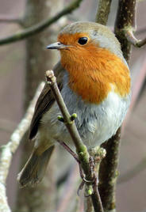

To make the remaining examples less verbose, we'll switch to using the short forms
`-i` and `-o` of `--input` and `--output`.

To do anything more interesting than changing image formats, we need to define an image processing
pipeline via `--pipeline`, or `-p`. This chains together a series of one or more
[operations](#operations).

For example, the following command line converts an image to grayscale.

<pre>imagecli -i robin.png -o ex2_0.png -p 'gray'</pre>


And the following rotates an image about its center by 45 degrees.

<pre>imagecli -i robin.png -o ex3_0.png -p 'rotate 45'</pre>
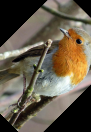

## Multi-stage pipelines

You can apply multiple operations in a row by chaining them together using `>`. For example, the
following pipeline converts an image to grayscale, rotates it by 30 degrees, and then computes
its gradient using the Sobel filter.

<pre>imagecli -i robin.png -o ex0_0.png -p 'gray > rotate 30 > sobel'</pre>
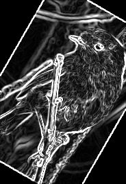

## The image stack

All of the pipelines shown thus far have taken a single image as input and produced a single image
as output. However, we also support operations mapping multiple inputs to a single output, as well
as operations mapping a single input to multiple outputs. This is handled via an implicit image
stack: all input images are pushed onto the top of an image stack, and each operation pops one or
more images from the top of the stack, applies some transformation, and pushes one or more output
images back onto the stack. All images provided via the command line are pushed onto the image
stack before we start running the pipeline, and when the pipeline completes we save the contents
of the image stack to the `--output` paths.

### Multiple inputs, single output

The following command line takes two images as input and applies the `hcat` operation, which
horizontally concatenates a pair of images.

<pre>imagecli -i robin.png robin_gray.png -o ex0_0.png -p 'hcat'</pre>
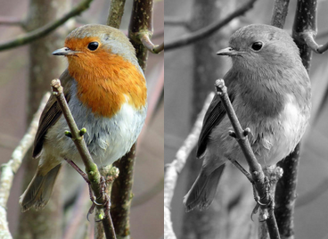

The diagram below shows the state of the image stack as this pipeline is run.

```
    |
    | input images are pushed onto the stack
    v
 --------------------
 * robin
   robin_gray
 --------------------
    |
    | hcat pops two images
    v
 --------------------
 --------------------
    |
    | hcat computes result and pushes it onto the stack
    v
 --------------------
 * result
 --------------------
    |
    | result is saved to the specified output path
    v
```

### Single input, multiple outputs

There aren't currently any image processing operations that produce multiple outputs from a
single input. However, pipelines can also contain stack operations - operations that directly
manipulate the image stack. These all have upper case names to make it easier to distinguish between image
processing operations and stack operations.

For example, the `DUP` operation duplicates the top element of the stack. The following example
loads a single image and then saves two copies of it.

<pre>imagecli -i robin.png -o ex0_0.png ex0_1.png -p 'DUP'</pre>


```
    |
    | input image is pushed onto the stack
    v
 --------------------
 * robin
 --------------------
    |
    | DUP duplicates the top of the stack
    v
 --------------------
 * robin
   robin
 --------------------
    |
    | results are saved to the specified output paths
    v
```

### Multiple inputs, multiple outputs

As described above, each operation in a pipeline pops a fixed number of images from the top
of the stack, applies a transformation to these images and pushes the results back onto the stack.
This means that the following example only applies the specified blur function to the first
input image.

<pre>imagecli -i robin.png robin_gray.png -o ex0_0.png ex0_1.png -p 'gaussian 5.0'</pre>


(Note that in the following diagrams we combine popping from the stack, applying a transformation,
and pushing the result into a single step.)

```
    |
    | input images are pushed onto the stack
    v
 --------------------
 * robin
   robin_gray
 --------------------
    |
    | gaussian pops the top of the stack, transforms it, and pushes the result
    v
 --------------------
 * results
   robin_gray
 --------------------
    |
    | results are saved to the specified output paths
    v
```

This may not be what you wanted! If you want to apply the `gaussian` operation to both of the two
images in the stack you have three options.

#### Option 1 - manual stack manipulation

The most flexible (and verbose) option is to use the `SWAP` stack operation to manually swap the order of the two
elements in the stack. `SWAP` is an alias for `ROT 2`, where the `ROT` operation rotates the
positions of the top `n` elements of the stack - the top element moves `n` positions down the stack
and the other top elements on the stack move up one.

```
 --------------------
 * first
   second
   third
 --------------------
    |
    | ROT 2
    v
 --------------------
 * second
   first
   third
 --------------------
    |
    | ROT 3
    v
 --------------------
 * first
   third
   second
 --------------------
    |
    | ROT 3
    v
 --------------------
 * third
   second
   first
 --------------------
```

The following command line uses `SWAP` to apply a Gaussian blur to both input images.
Notice the second `SWAP` operation, which ensures that the outputs are in the same order as the
inputs.

<pre>imagecli -i robin.png robin_gray.png -o ex0_0.png ex0_1.png -p 'gaussian 5.0 > SWAP > gaussian 5.0 > SWAP'</pre>

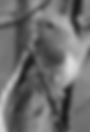

```
    |
    | push input images
    v
 --------------------
 * robin
   robin_gray
 --------------------
    |
    | the first gaussian operation transforms the top of the stack
    v
 --------------------
 * robin_blurred
   robin_gray
 --------------------
    |
    | SWAP swaps the order of the two stack elements
    v
 --------------------
 * robin_gray
   robin_blurred
 --------------------
    |
    | the second gaussian operation transforms the top of the stack
    v
 --------------------
 * robin_gray_blurred
   robin_blurred
 --------------------
    |
    | SWAP swaps the order of the two stack elements
    v
 --------------------
 * robin_blurred
   robin_gray_blurred
 --------------------
    |
    | save result
    v
```

#### Option 2 - arrays

As manually rotating through the image stack can be a bit verbose, we also support an array syntax
which applies the *n*th in a series of operations to the *n*th element in the stack. For example,
the following command line applies a Gaussian blur to the first image, and a blur with larger
radius to the second.

<pre>imagecli -i robin.png robin_gray.png -o ex0_0.png ex0_1.png -p '[gaussian 2.0, gaussian 6.0]'</pre>


The description above assumes that each operation in the array consumes a single input and produces
a single result. Array operations are actually more general than this, as the operations within
them may consume more than one input or produce more than one result. In this case each operation
is applied to the stack in turn, and the results pushed by each operation are popped into temporary
storage before applying the next. Finally, all of the results are pushed to the stack.
`DUP n` is treated as consuming 1 image and creating `n + 1` results, and `ROT n` is always treated
as producing no outputs.

If this explanation isn't clear then look through the stack diagram for the example below. Or
don't - you'll probably never have cause to use this behaviour!

<pre>imagecli -i yellow.png robin.png robin_gray.png -o ex1_0.png -p '[DUP, hcat] > [vcat, id] > hcat'</pre>
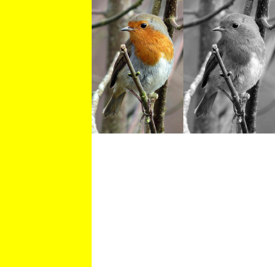

```
    |
    | push input images
    v
 --------------------
 * yellow
   robin
   robin_gray
 --------------------
    |
    | DUP is applied to the first image in the stack, and hcat to the remaining two
    v
 --------------------
 * yellow
   yellow
   robins
 --------------------
    |
    | vcat is applied to the first two images in the stack, and id to the last image
    v
 --------------------
 * yellows
   robins
 --------------------
    |
    | the two images are horizontally concatenated
    v
 --------------------
 * yellows_robins
 --------------------
    |
    | save results
    v
```

#### Option 3 - map

Finally, you can use the `MAP` operation.

<pre>imagecli -i robin.png robin_gray.png -o ex0_0.png ex0_1.png -p 'MAP gaussian 2.0'</pre>


This is equivalent to applying an array of operations whose length is
equal to the size of the image stack divided by the number of inputs to
the mapped operation (one for `gaussian`, two for `hcat`, etc.).

The following example demonstrates the effect of mapping an operation that makes
multiple inputs.

<pre>imagecli -i robin.png -o ex1_0.png -p 'DUP 5 > [id, rotate 10, rotate 20, rotate 30, rotate 40, rotate 50] > MAP hcat 3 > vcat'</pre>
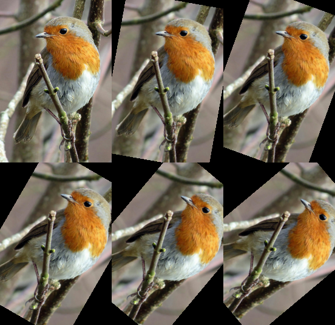

## Glob inputs

Glob patterns can be used to specify the set of input files to read, for example to match all files in a
directory with a png extension.

All of the matching images are inserted into [the image stack](#the-image-stack), and then the
supplied pipeline is run. In the common case that you want to perform an operation on each input
image you can use the [map](#option-3---map) operation.

<pre>imagecli -i robin*.png -o ex0_0.png ex0_1.png -p 'MAP (vflip > rotate 20)'</pre>
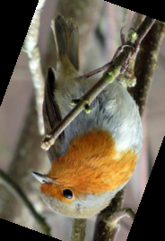
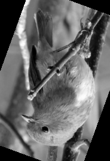

## Variable number of output images

Instead of providing a list of output image paths you can provide a single output path containing `{n}`.
In this case the pipeline will be run and then every image on the stack will be saved, replacing `{n}`
with the distance of this image from the top of the stack. For example, if you specify an output path
of `some_path_{n}.png` then the first image on the stack will be saved to `some_path_0.png`, the second
to `some_path_1.png`, and so on. You can optionally specify a minimum number of digits to use
for the image count. For example, an output path of `some_path_{n:3}.png` results in the first image
in the stack being saved to `some_path_000.png`.

<pre>imagecli -i robin.png -o ex0_{n}.png -p 'tile 100 150'</pre>


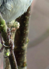

## User-defined functions

We provide limited support for user-defined functions via the `func`, `func2` and `func3`
operations. These operations allow you to specify a function to run on each subpixel of an image.
Functions are arithmetic expressions defined in terms of the following components:
* Binary arithmetic operators `+`, `-`, `/`, `*` and `^`.
* Parentheses '(' and ')'.
* Numerical constants, e.g. `4.0`.
* Coordinate variables `x` and `y`. `x` increases from left to right and `y` from top to bottom.
* Variables `p`, `q` and `r`. `p` is the value of the current subpixel in the first image,
  `q` and `r` in the second and third images.
* Comparison operators `<`, `>` and `=`. These evaluate to `1.0` if true and `0.0` if false.

The following function applies a diagonal gradient to an image, increasing its
brightness towards its bottom right.

<pre>imagecli -i robin.png -o ex0_0.png -p 'func { p + x / 2 + y / 2 }'</pre>
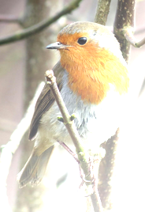

The following example converts an image to grayscale and then applies a binary threshold. (This is
equivalent to `thresh 120`, but takes longer to run and requires first converting to
grayscale - otherwise the threshold would be applied independently to each channel.)

<pre>imagecli -i robin.png -o ex1_0.png -p 'gray > func { 255 * (p > 120) }'</pre>
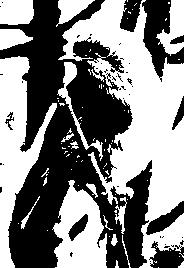

Our final example uses `func2` to apply a user-defined function to a pair of images.

<pre>imagecli -i robin.png -o ex2_0.png -p 'new 184 268 (255, 255, 0) > MAP DUP > ROT 3 > func2 { (p + q) / 2 } > ROT 3 > hcat 3'</pre>
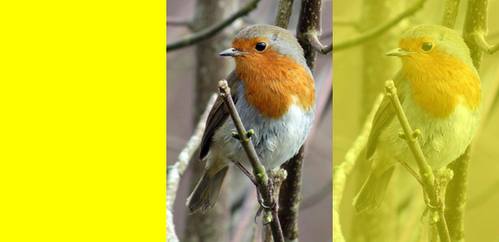

Current limitations:
* All input images to `func2` and `func3` are required to be the same size.
* Applying different functions to each subpixel (or a function from pixels to pixels) is not
  yet supported.
* All images are converted to RGBA before applying the function.
* There is not yet support for calling out to other functions (e.g. min, max, sin).

## Operations

The following conventions are used to describe the arguments taken by each operation.

* `<foo>`: a required positional argument. For example, `rotate <angle>` accepts the input `rotate 17`.
* `[foo]`: an optional positional argument. For example, `hcat [count]` accepts both `hcat` and `hcat 5`.
* `, ..`: repetition - one or more occurrences of the preceding argument, separated by commas. For example, `op <val>, ..` accepts `op 1` and `op 1, 2`.
* `(LEFT|RIGHT)`: something that matches either LEFT, or RIGHT. For example, `resize (<width> <height>|w=<width>)` accepts both `resize 100 100` and `resize w=100`.
* `'T'`: the literal character `T`, if `T` is given special meaning above. For example, `op '[' <val> ']'` accepts the input `op [ 10 ]`.

Follow the links for a more detailed description, including any restrictions on the inputs (for example that a value
must be an integer, or must be strictly positive).

Operation|Usage|Description
---|---|---
[AdaptiveThreshold](#adaptivethreshold)|`athresh <block_radius>`|Binarises an image using adaptive thresholding.
[Array](#array)|`[IMAGE_OP, .. ]`|Applies a series of image operations to the stack.
[Blue](#blue)|`blue`|Extracts the blue channel from an image as a grayscale image.
[Carve](#carve)|`carve <width_ratio>`|Shrinks an image's width using seam carving.
[Circle](#circle)|`circle <filltype> <cx> <cy> <radius> '('COLOR')'`|Draws a circle on an image.
[Const](#const)|`const <width> <height> '('COLOR')'`|Replaces the top of the image stack with an image with a single constant value.
[Crop](#crop)|`crop <left> <top> <width> <height>`|Extracts a rectangular region from an image.
[Dup](#dup)|`DUP [count]`|Duplicates the top element of the image stack `count` times. `count` defaults to 1 if not provided.
[Func](#func)|`func { EXPR }`|Applies a user-provided function to each subpixel in an image.
[Func2](#func2)|`func2 { EXPR }`|Applies a user-provided function pairwise to the subpixels in two images.
[Func3](#func3)|`func3 { EXPR }`|Applies a user-provided function pairwise to the subpixels in three images.
[Gaussian](#gaussian)|`gaussian <standard_deviation>`|Applies a Gaussian blur to an image.
[Gray](#gray)|`gray`|Converts an image to grayscale.
[Green](#green)|`green`|Extracts the green channel from an image as a grayscale image.
[Grid](#grid)|`grid <columns> <rows>`|Arranges a series of images into a grid.
[HCat](#grid)|`hcat [columns]`|See [Grid](#grid).
[HFlip](#hflip)|`hflip`|Flips an image horizontally.
[Id](#id)|`id`|Applies the identity function, i.e. does nothing.
[Map](#map)|`MAP IMAGE_OP`|Maps a single operation over the stack.
[Median](#median)|`median <x_radius> <y_radius>`|Applies a median filter to an image.
[New](#new)|`new <width> <height> '('COLOR')'`|Creates an image with a single constant value.
[OtsuThreshold](#otsuthreshold)|`othresh`|Binarises an image using Otsu thresholding.
[Overlay](#overlay)|`overlay <left> <top>`|Overlays the second image on the stack onto the first.
[Pad](#pad)|`pad <top> <right> <bottom> <left> '('COLOR')'`|Pads an image with borders of a given size (px) and color.
[Red](#red)|`red`|Extracts the red channel from an image as a grayscale image.
[Resize](#resize)|`resize (<width> <height>\|w=<width>\|h=<height>\|w=<width> h=<height>)`|Resizes an image to the given dimensions.
[Rot](#rot)|`ROT [count]`|Rotates the top `count` elements of the stack by 1.
[Rotate](#rotate)|`rotate <angle>`|Rotates an image clockwise about its center.`angle` gives the angle of rotation in degrees.
[Scale](#scale)|`scale <ratio>`|Scales image width and height by `ratio`.
[Sequence](#sequence)|`(IMAGE_OP > .. )`|Applies a sequence of image operations in order.
[Sobel](#sobel)|`sobel`|Computes image gradients using the Sobel filter.
[Swap](#rot)|`SWAP`|See [Rot](#rot).
[Threshold](#threshold)|`thresh`|Binarises an image using a user-defined threshold.
[Tile](#tile)|`tile <tile_width> <tile_height>`|Splits an image into tiles.
[Translate](#translate)|`translate <tx> <ty>`|Translates an image by `(tx, ty)`.
[VCat](#grid)|`vcat [rows]`|See [Grid](#grid).
[VFlip](#vflip)|`vflip`|Flips an image vertically.


### Array

Usage: `[IMAGE_OP, .. ]`

Applies a series of image operations to the stack.

If each operation consumes a single input and produces a single image as a result then the nth
operation is applied to the nth image in the stack.

In the more general case we first walk through each operation, apply it to the stack and pop
all of its results. We then push all the results to the stack.

#### Examples

<pre>imagecli -i robin.png -o Array_0_0.png -p 'DUP 3 > [id, red, green, blue] > hcat 4'</pre>
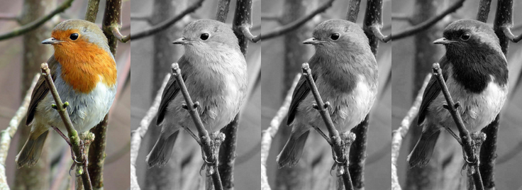

### AdaptiveThreshold

Usage: `athresh <block_radius>`

Binarises an image using adaptive thresholding.

`block_radius` is required to be an integer `>= 0`. Each pixel is compared to those in the block around it with side length `2 * block_radius + 1`.

#### Examples

<pre>imagecli -i robin.png -o AdaptiveThreshold_0_0.png -p 'athresh 10'</pre>
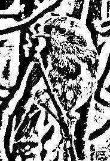

### Blue

Usage: `blue`

Extracts the blue channel from an image as a grayscale image.

#### Examples

<pre>imagecli -i robin.png -o Blue_0_0.png -p 'DUP > [id, blue] > hcat'</pre>
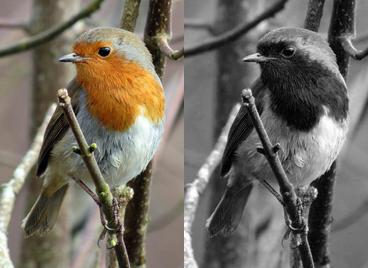

### Carve

Usage: `carve <width_ratio>`

Shrinks an image's width using seam carving.

`width_ratio` is required to be a floating point number `<= 1.0`. The output image has width `width_ratio * input_image_width`.

#### Examples

<pre>imagecli -i robin.png -o Carve_0_0.png -p 'carve 0.85'</pre>


### Circle

Usage: `circle <filltype> <cx> <cy> <radius> '('COLOR')'`

Draws a circle on an image.

`filltype` can be either `hollow` or `filled`. `color` can be: grayscale: `(12)`, grayscale with alpha: `(12, 255)`, RGB: `(255, 0, 255)`, or RGBA: `(128, 128, 0, 255)`.

#### Examples

<pre>imagecli -i robin.png -o Circle_0_0.png -p 'circle filled 80 40 50 (255, 255, 0)'</pre>
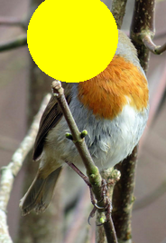

### Const

Usage: `const <width> <height> '('COLOR')'`

Replaces the top of the image stack with an image with a single constant value.

`color` can be grayscale: `(12)`, grayscale with alpha: `(12, 255)`, RGB: `(255, 0, 255)`, or RGBA: `(128, 128, 0, 255)`.

Note that this consumes an image from the stack. If this is not the behaviour you want then use the `new` operation.

#### Examples

<pre>imagecli -i robin.png -o Const_0_0.png -p 'const 300 250 (255, 255, 0)'</pre>


### Crop

Usage: `crop <left> <top> <width> <height>`

Extracts a rectangular region from an image.

Returns a copy of the image region with inclusive top left point `(left, top)`
and dimensions `(width, height)`.

#### Examples

<pre>imagecli -i robin.png -o Crop_0_0.png -p 'crop 10 50 100 150'</pre>


### Dup

Usage: `DUP [count]`

Duplicates the top element of the image stack `count` times. `count` defaults to 1 if not provided.

### Func

Usage: `func { EXPR }`

Applies a user-provided function to each subpixel in an image.

See the [user-defined functions](#user-defined-functions) section of the user guide for more information.

#### Examples

<pre>imagecli -i robin.png -o Func_0_0.png -p 'func { p + x / 3 + y / 3 }'</pre>
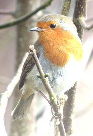
<pre>imagecli -i robin.png -o Func_1_0.png -p 'gray > func { 255 * (p > 100) }'</pre>
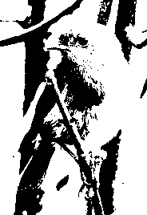

### Func2

Usage: `func2 { EXPR }`

Applies a user-provided function pairwise to the subpixels in two images.

See the [user-defined functions](#user-defined-functions) section of the user guide for more information.

#### Examples

<pre>imagecli -i robin.png -o Func2_0_0.png -p 'new 184 268 (255, 255, 0) > MAP DUP > ROT 3 > func2 { (p + q) / 2 } > ROT 3 > hcat 3'</pre>


### Func3

Usage: `func3 { EXPR }`

Applies a user-provided function pairwise to the subpixels in three images.

See the [user-defined functions](#user-defined-functions) section of the user guide for more information.

### Gaussian

Usage: `gaussian <standard_deviation>`

Applies a Gaussian blur to an image.

#### Examples

<pre>imagecli -i robin.png -o Gaussian_0_0.png -p 'gaussian 10.0'</pre>
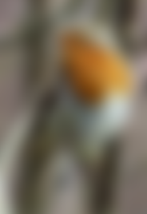

### Gray

Usage: `gray`

Converts an image to grayscale.

#### Examples

<pre>imagecli -i robin.png -o Gray_0_0.png -p 'gray'</pre>


### Green

Usage: `green`

Extracts the green channel from an image as a grayscale image.

#### Examples

<pre>imagecli -i robin.png -o Green_0_0.png -p 'DUP > [id, green] > hcat'</pre>
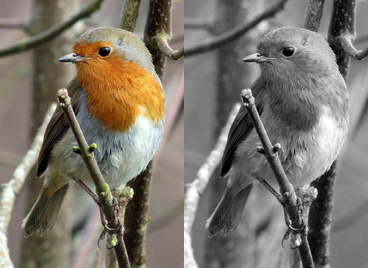

### Grid

Usage: `grid <columns> <rows>`

Arranges a series of images into a grid.

##### Alias: HCat

Usage: `hcat [columns]`

`hcat` is equivalent to `grid 2 1`. `hcat n` is equivalent to `grid n 1`.

##### Alias: VCat

Usage: `vcat [rows]`

`vcat` is equivalent to `grid 1 2`. `vcat n` is equivalent to `grid 1 n`.

#### Examples

<pre>imagecli -i robin.png -o Grid_0_0.png -p 'DUP 3 > [gaussian 1.0, gaussian 3.0, gaussian 5.0,gaussian 7.0] > grid 2 2'</pre>
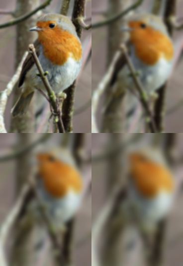
<pre>imagecli -i robin.png -o Grid_1_0.png -p 'scale 0.5 > DUP 5 > [scale 1.0, scale 0.9, scale 0.8, scale 0.7, scale 0.6, scale 0.5] > grid 3 2'</pre>
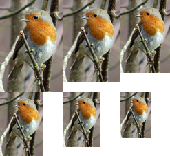

### HFlip

Usage: `hflip`

Flips an image horizontally.

#### Examples

<pre>imagecli -i robin.png -o HFlip_0_0.png -p 'DUP > [id, hflip] > hcat'</pre>
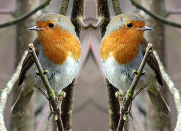

### Id

Usage: `id`

Applies the identity function, i.e. does nothing.

This makes some pipelines more concise to write.

### Map

Usage: `MAP IMAGE_OP`

Maps a single operation over the stack.

Equivalent to `[IMAGE_OP, ..]` with length equal to `stack size / number of inputs to IMAGE_OP.`

#### Examples

<pre>imagecli -i robin.png -o Map_0_0.png -p 'DUP 3 > [id, red, green, blue] > MAP gaussian 2.0 > hcat 4'</pre>

<pre>imagecli -i robin.png -o Map_1_0.png -p 'DUP 5 > [id, rotate 10, rotate 20, rotate 30, rotate 40, rotate 50] > MAP hcat 3 > vcat'</pre>


### Median

Usage: `median <x_radius> <y_radius>`

Applies a median filter to an image.

The filter applied has width `2 * x_radius + 1` and height `2 * y_radius + 1`.

#### Examples

<pre>imagecli -i robin.png -o Median_0_0.png -p 'median 4 4'</pre>


### New

Usage: `new <width> <height> '('COLOR')'`

Creates an image with a single constant value.

`color` can be grayscale: `(12)`, grayscale with alpha: `(12, 255)`, RGB: `(255, 0, 255)`, or RGBA: `(128, 128, 0, 255)`.

Note that this operation consumes no inputs - it just pushes a new image onto the stack. If you want to replace the top image on the stack with a constant value then use the `const` operation.

#### Examples

<pre>imagecli -o New_0_0.png -p 'new 200 150 (0, 0, 255)'</pre>


### OtsuThreshold

Usage: `othresh`

Binarises an image using Otsu thresholding.

#### Examples

<pre>imagecli -i robin.png -o OtsuThreshold_0_0.png -p 'othresh'</pre>
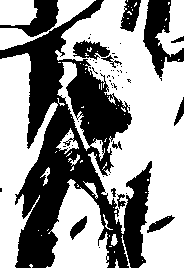

### Overlay

Usage: `overlay <left> <top>`

Overlays the second image on the stack onto the first.

Places the second image with its top left corner at `(left, top )` on the first image,
cropping if it does not fit.

#### Examples

<pre>imagecli -i robin.png -o Overlay_0_0.png -p 'new 184 268 (255, 255, 0) > overlay 10 50'</pre>
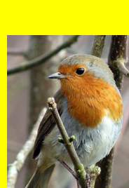

### Pad

Usage: `pad <top> <right> <bottom> <left> '('COLOR')'`

Pads an image with borders of a given size (px) and color.

`color` can be grayscale: `(12)`, grayscale with alpha: `(12, 255)`, RGB: `(255, 0, 255)`, or RGBA: `(128, 128, 0, 255)`. The image will be converted to the color space used here.

#### Examples

<pre>imagecli -i robin.png -o Pad_0_0.png -p 'pad 10 20 30 40 (255, 255, 0)'</pre>
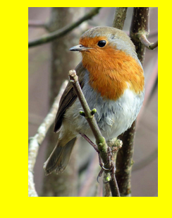

### Red

Usage: `red`

Extracts the red channel from an image as a grayscale image.

#### Examples

<pre>imagecli -i robin.png -o Red_0_0.png -p 'DUP > [id, red] > hcat'</pre>
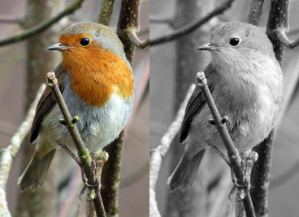

### Resize

Usage: `resize (<width> <height>|w=<width>|h=<height>|w=<width> h=<height>)`

Resizes an image to the given dimensions.

If only one of width or height is provided then the target for the other dimension is chosen to preserve the image's aspect ratio.

#### Examples

<pre>imagecli -i robin.png -o Resize_0_0.png -p 'resize w=100'</pre>


### Rot

Usage: `ROT [count]`

Rotates the top `count` elements of the stack by 1.

        `count` defaults to 3 if not provided.

##### Alias: Swap

Usage: `SWAP`

`SWAP` is equivalent to `ROT 2`.

### Rotate

Usage: `rotate <angle>`

Rotates an image clockwise about its center.`angle` gives the angle of rotation in degrees.

#### Examples

<pre>imagecli -i robin.png -o Rotate_0_0.png -p 'rotate 45'</pre>


### Scale

Usage: `scale <ratio>`

Scales image width and height by `ratio`.

#### Examples

<pre>imagecli -i robin.png -o Scale_0_0.png -p 'scale 0.7'</pre>


### Sequence

Usage: `(IMAGE_OP > .. )`

Applies a sequence of image operations in order.

The pipeline `(OP1 > OP2)` has exactly the same result as `OP1 > OP2`.
The purpose of this operation is to allow more flexibility when using arrays (`[..]`)
or `map` operations.

#### Examples

<pre>imagecli -i robin.png -o Sequence_0_0.png -p 'scale 0.7 > DUP 3 > [id, hflip, vflip, (hflip > vflip)] > grid 2 2'</pre>
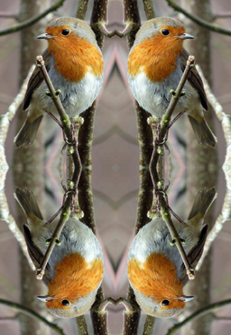
<pre>imagecli -i robin.png -o Sequence_1_0.png -p 'DUP > MAP (gray > rotate 30) > hcat'</pre>


### Sobel

Usage: `sobel`

Computes image gradients using the Sobel filter.

#### Examples

<pre>imagecli -i robin.png -o Sobel_0_0.png -p 'sobel'</pre>
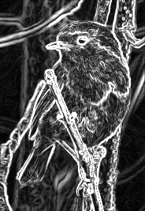

### Threshold

Usage: `thresh`

Binarises an image using a user-defined threshold.

Images are first converted to grayscale. Thresholds should be `>=0` and `< 256`.

#### Examples

<pre>imagecli -i robin.png -o Threshold_0_0.png -p 'thresh 120'</pre>


### Tile

Usage: `tile <tile_width> <tile_height>`

Splits an image into tiles.

Tiles at the right and bottom may be smaller than the specified size.
Tiles are pushed onto the stack in reversed row-major order:
after the operation, the top left tile will be at the top of the stack.

#### Examples

<pre>imagecli -i robin.png -o Tile_0_0.png Tile_0_1.png Tile_0_2.png Tile_0_3.png -p 'tile 100 150'</pre>


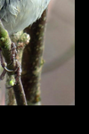

### Translate

Usage: `translate <tx> <ty>`

Translates an image by `(tx, ty)`.

Positive values of `tx` move the image to the right, and positive values of `ty` move it downwards.

#### Examples

<pre>imagecli -i robin.png -o Translate_0_0.png -p 'DUP > [translate 10 20, translate -10 -20] > hcat'</pre>
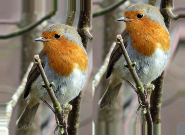

### VFlip

Usage: `vflip`

Flips an image vertically.

#### Examples

<pre>imagecli -i robin.png -o VFlip_0_0.png -p 'DUP > [id, vflip] > hcat'</pre>
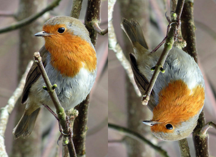

