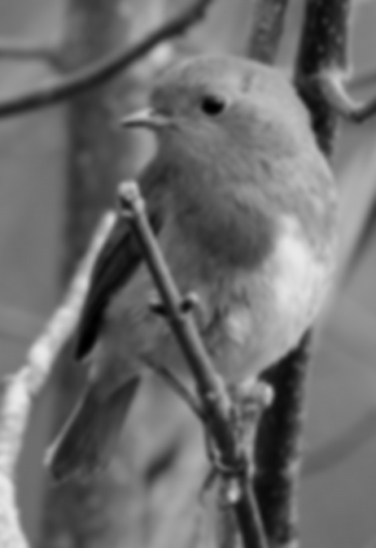

imagecli
====

A command line image processing tool, built on top of [image](https://github.com/image-rs/image) and [imageproc](https://github.com/image-rs/imageproc).

Very WIP.

<pre>
cargo run --release -- -v -i images/robin.jpg -o images/morphed.png -p 'gray > gaussian 10.0 > scale 0.3 > rotate 45'
</pre>

Converts:

Into:

