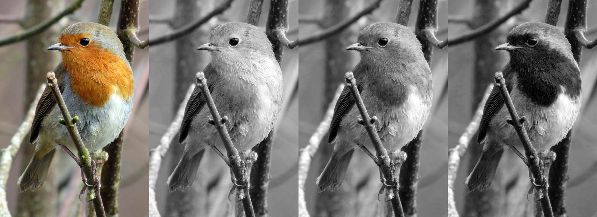
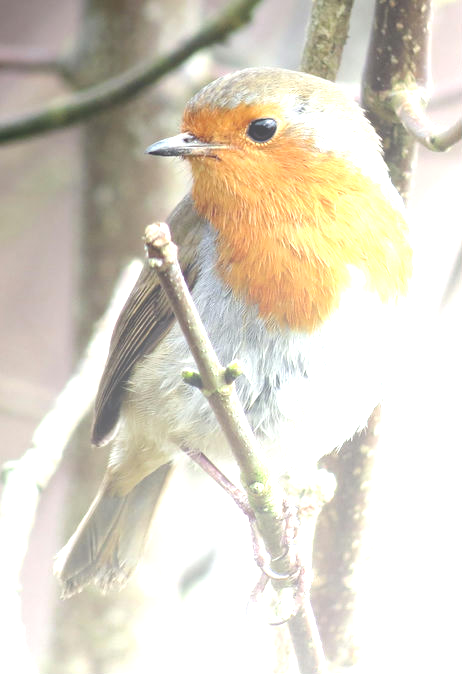

imagecli
====

A command line image processing tool, built on top of [image](https://github.com/image-rs/image) and [imageproc](https://github.com/image-rs/imageproc).

Very WIP.

# Examples

All examples use the following input image.

<pre>
cargo run --release -- -v -i images/robin.jpg -o images/1.png -p 'gray > scale 0.7 > rotate 45'
</pre>

<pre>
cargo run --release -- -v -i images/robin.jpg -o images/2.png -p 'sobel'
</pre>

<pre>
cargo run --release -- -v -i images/robin.jpg -o images/3.png -p 'carve 0.85'
</pre>

<pre>
cargo run --release -- -v -i images/robin.jpg -o images/4.png -p 'DUP > athresh 10 > SWAP > othresh > hcat'
</pre>

<pre>
cargo run --release -- -v -i images/robin.jpg -o images/5.png -p 'DUP 3 > gaussian 15.0 > ROT 4 > gaussian 10.0 > ROT 3 > gaussian 5.0 > ROT 2 > grid 2 2'
</pre>

<pre>
cargo run --release -- -v -i images/robin.jpg -o images/6.png -p 'median 6 6'
</pre>

<pre>
cargo run --release -- -v -i images/robin.jpg images/robin_gray.jpg -o images/7.png -p 'hcat'
</pre>

<pre>
cargo run --release -- -v -i images/robin.jpg images/robin_gray.jpg -o images/8.png images/9.png -p 'rotate 10 > SWAP > rotate 20 > SWAP'
</pre>

<pre>
cargo run --release -- -v -i images/robin.jpg -o images/10.png -p 'DUP 3 > [gaussian 1.0, gaussian 3.0, gaussian 5.0, gaussian 7.0] > grid 2 2'
</pre>

<pre>
cargo run --release -- -v -i images/robin.jpg -o images/11.png -p 'DUP 3 > [id, red, green, blue] > hcat 4'
</pre>

<pre>
cargo run --release -- -v -i images/robin.jpg -o images/12.png -p 'scale 0.5 > DUP 8 > [scale 1.0, scale 0.9, scale 0.9, scale 0.7, scale 0.6, scale 0.5, scale 0.4, scale 0.3, scale 0.2] > grid 3 3'
</pre>

<pre>
cargo run --release -- -v -i images/robin.jpg -o images/13.png -p 'func (p + x / 5 + y / 5)'
</pre>

<pre>
cargo run --release -- -v -i images/robin.jpg -o images/14.png -p 'const 300 250 (255, 255, 0)'
</pre>

<pre>
cargo run --release -- -v -i images/robin.jpg -o images/15.png -p 'circle filled 231 337 100 255 255 0'
</pre>

