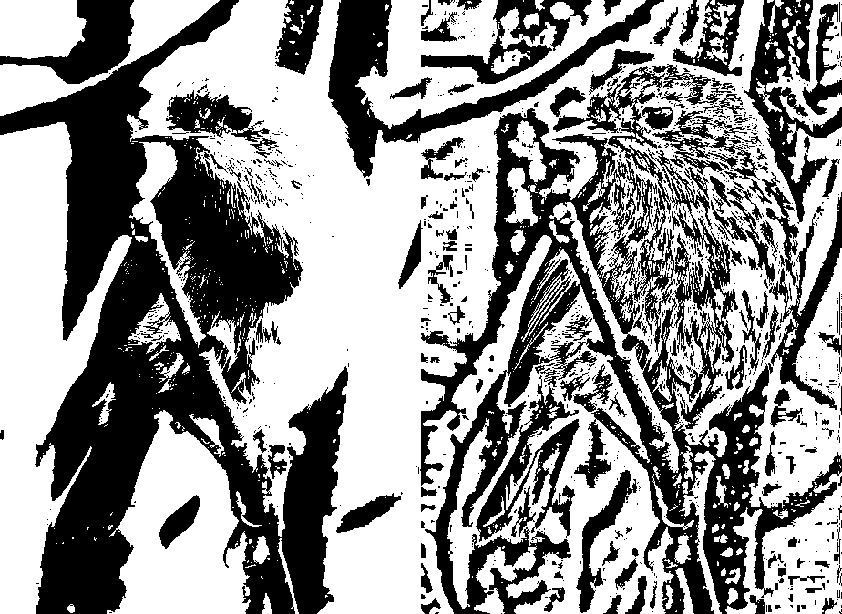

imagecli
====

A command line image processing tool, built on top of [image](https://github.com/image-rs/image) and [imageproc](https://github.com/image-rs/imageproc).

Very WIP.

# Examples

All examples use the following input image.

<pre>
cargo run --release -- -v -i images/robin.jpg -o images/1.png -p 'gray > gaussian 5.0 > scale 0.7 > rotate 45'
</pre>

<pre>
cargo run --release -- -v -i images/robin.jpg -o images/2.png -p 'sobel'
</pre>

<pre>
cargo run --release -- -v -i images/robin.jpg -o images/3.png -p 'carve 0.85'
</pre>

<pre>
cargo run --release -- -v -i images/robin.jpg -o images/4.png -p 'scale 0.4 > DUP > athresh 10 > SWAP > othresh > hcat'
</pre>

<pre>
cargo run --release -- -v -i images/robin.jpg -o images/5.png -p 'scale 0.4 > DUP > gaussian 5.0 > SWAP > vcat'
</pre>

